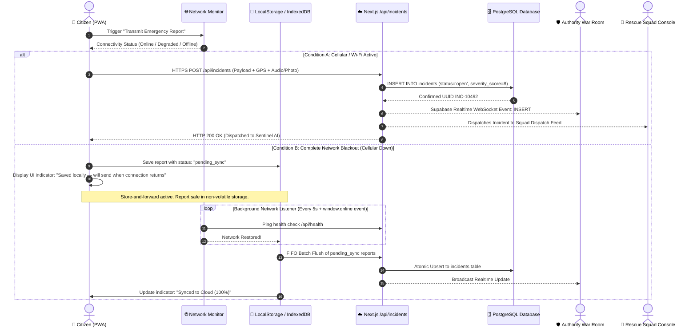
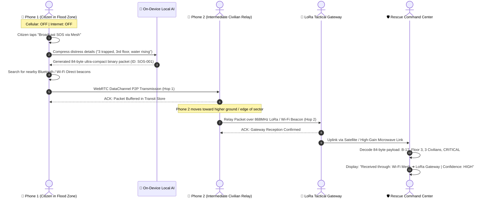
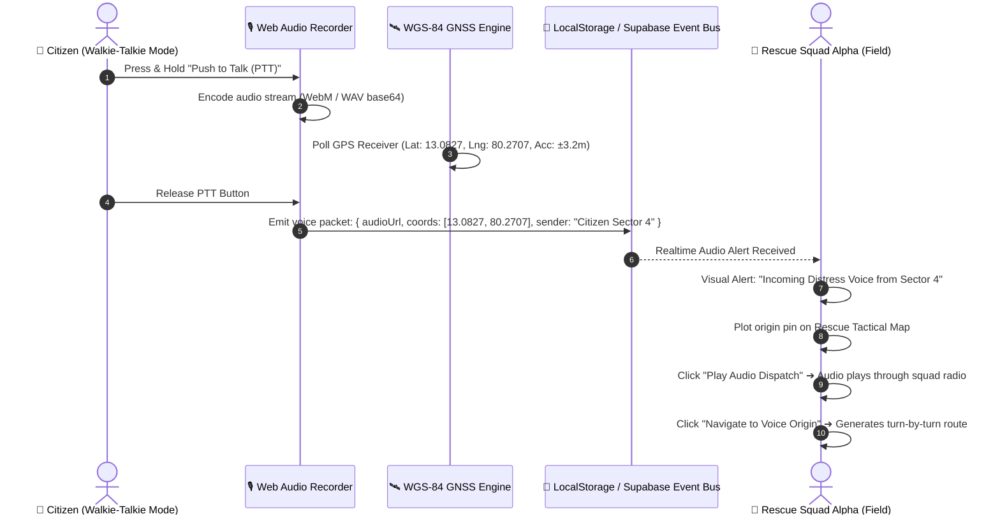
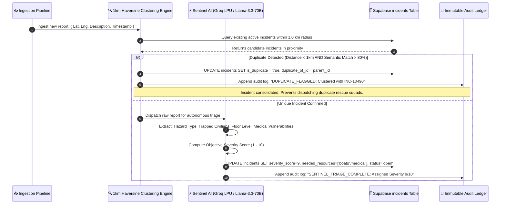
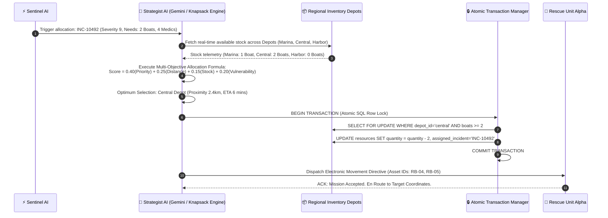
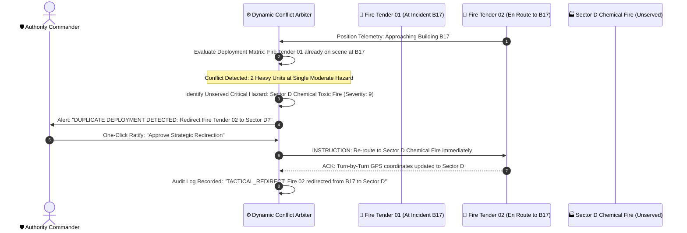
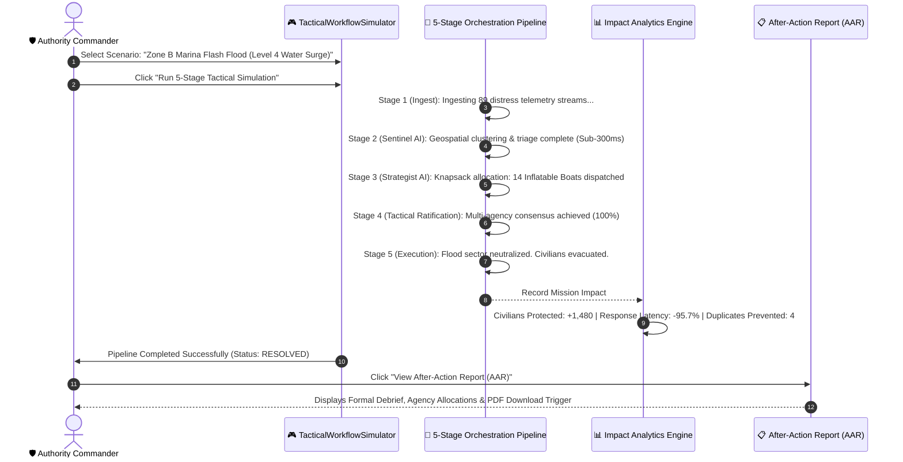

# RESQNET / KURUKSHETRA PS20 — Complete Architectural Specification & System Documentation

> **Problem Statement 20 (PS20)**: *Agentic Disaster Relief & Emergency Resource Coordinator*  
> **System Name**: **RESQNET** (*Resilient Emergency Communication & Autonomous Resource Coordination Network*)  
> **Team**: Neural Nova (KH-132)  
> **Classification**: Mission-Critical Tactical Disaster Response Software  
> **Release Version**: v2.4.0 (Production Hackathon Build)  

---

## Table of Contents
1. [Executive Summary & System Identity](#1-executive-summary--system-identity)
2. [High-Level System Architecture & Topology](#2-high-level-system-architecture--topology)
3. [Comprehensive Technology Stack Matrix](#3-comprehensive-technology-stack-matrix)
4. [End-to-End Operational Workflows](#4-end-to-end-operational-workflows)
   - [Workflow 1: Citizen SOS Ingestion & Multi-Transport Resilience](#workflow-1-citizen-sos-ingestion--multi-transport-resilience)
   - [Workflow 2: P2P Multi-Hop Mesh Relay & LoRa Packet Serialization](#workflow-2-p2p-multi-hop-mesh-relay--lora-packet-serialization)
   - [Workflow 3: Voice Distress Dispatch with Origin GPS Tracking](#workflow-3-voice-distress-dispatch-with-origin-gps-tracking)
   - [Workflow 4: Autonomous Sentinel AI Triage & Deduplication](#workflow-4-autonomous-sentinel-ai-triage--deduplication)
   - [Workflow 5: Strategist AI Combinatorial Resource Allocation](#workflow-5-strategist-ai-combinatorial-resource-allocation)
   - [Workflow 6: Dynamic Resource Reallocation & Duplicate Redirection](#workflow-6-dynamic-resource-reallocation--duplicate-redirection)
   - [Workflow 7: Authority Tactical Workflow Simulation & After-Action Report](#workflow-7-authority-tactical-workflow-simulation--after-action-report)
5. [Subsystem Deep Dives](#5-subsystem-deep-dives)
   - [5.1 Citizen Portal & Progressive Web App (PWA)](#51-citizen-portal--progressive-web-app-pwa)
   - [5.2 Universal Feature Information Tooltip System](#52-universal-feature-information-tooltip-system)
   - [5.3 Authority War Room & Tactical Workflow Simulator](#53-authority-war-room--tactical-workflow-simulator)
   - [5.4 Rescue Field Squad Console](#54-rescue-field-squad-console)
   - [5.5 Multi-Model Disaster AI Waterfall & Safety Guardrails](#55-multi-model-disaster-ai-waterfall--safety-guardrails)
   - [5.6 Ultra-Low Bandwidth LoRa Binary Serialization](#56-ultra-low-bandwidth-lora-binary-serialization)
6. [Data Models, Schemas & API Contracts](#6-data-models-schemas--api-contracts)
7. [Security, Governance & Cryptographic Audit Ledger](#7-security-governance--cryptographic-audit-ledger)
8. [Deployment, Runtime & CI/CD Pipeline](#8-deployment-runtime--cicd-pipeline)

---

## 1. Executive Summary & System Identity

During catastrophic natural disasters—including severe coastal storm surges, urban flash floods, earthquakes, and industrial hazardous material fires—traditional commercial communication networks (cellular base stations, fiber backbones, and internet service providers) collapse within hours. 

Civilian distress calls fail to transmit, emergency dispatch centers become paralyzed by thousands of duplicate unverified reports, and scarce emergency assets (flood rescue boats, heavy foam tenders, advanced trauma ambulances) sit idle at distant depots or are double-booked to identical locations.

### The Core Differentiator: RESQNET
**RESQNET is not a generic conversational chatbot.** It is a full-stack, distributed multi-agent command and resilient communication system designed for civil defense authorities (NDRF, SDRF, SDMA), first-responder rescue squads, and trapped citizens:

1. **Multi-Transport Communication Layer**: Transparently falls back across 4 tiers when infrastructure fails:
   $$\text{Cellular / Fibre 4G/5G} \longrightarrow \text{P2P WebRTC / BLE Mesh} \longrightarrow \text{Store-and-Forward Buffer} \longrightarrow \text{LoRa 868/915MHz Gateway} \longrightarrow \text{Satellite Uplink}$$
2. **On-Device Local AI Triage**: Compresses voice audio and textual distress cries into a hyper-dense **84-byte binary packet** on-device without cloud connectivity.
3. **Sub-300ms Autonomous Sentinel AI**: Ingests unstructured emergency reports, extracts hazard types, parses building floors and trapped person counts, computes an objective triage severity score (1–10), and performs 1 km Haversine deduplication.
4. **Strategist AI Knapsack Allocation**: Solves multi-objective resource scarcity using deterministic mathematical scoring ($0.40P + 0.25D + 0.15S + 0.20V$) with atomic PostgreSQL locking to prevent double-booking.
5. **Dynamic Reallocation & Conflict Arbiter**: Automatically preempts and redirects lower-priority assets when high-vulnerability life-safety emergencies erupt.
6. **Universal Feature Guidance (`FeatureInfoTooltip`)**: Provides comprehensive operational and disaster use-case guidance across every single interactive control and panel in the platform.

---

## 2. High-Level System Architecture & Topology

The system uses an event-driven, closed-loop distributed architecture organized into five architectural tiers:

```
┌──────────────────────────────────────────────────────────────────────────────────────────────────┐
│                                 TIER 1: CLIENT ACCESS & USER EXPERIENCES                         │
├────────────────────────────────┬────────────────────────────────┬────────────────────────────────┤
│      CITIZEN PORTAL (PWA)      │      AUTHORITY WAR ROOM        │     RESCUE FIELD CONSOLE       │
│  - Instant SOS Trigger         │  - 60/40 GIS Telemetry Desk    │  - Real-Time Tactical Cards    │
│  - Store-and-Forward Buffer    │  - Tactical Workflow Simulator │  - Voice Dispatch with GPS     │
│  - P2P Mesh Walkie-Talkie      │  - CAP Broadcast Emitter       │  - Turn-by-Turn Safe Routing   │
│  - Universal Feature Tooltips  │  - After-Action Report (AAR)   │  - Offline Squad Copilot       │
└────────────────────────────────┴────────────────────────────────┴────────────────────────────────┘
                                                │
                                                ▼
┌──────────────────────────────────────────────────────────────────────────────────────────────────┐
│                             TIER 2: RESILIENT MULTI-TRANSPORT NETWORK                            │
├───────────────────────┬───────────────────────┬────────────────────────┬─────────────────────────┤
│  HTTPS / WSS Gateway  │  WebRTC DataChannel   │ LocalStorage / IdxDB   │ 84-Byte LoRa Packetizer │
│  (Normal Connectivity)│  (P2P Browser Mesh)   │ (Offline Buffer Sync)  │ (Sub-GHz Radio Sim)     │
└───────────────────────┴───────────────────────┴────────────────────────┴─────────────────────────┘
                                                │
                                                ▼
┌──────────────────────────────────────────────────────────────────────────────────────────────────┐
│                           TIER 3: API GATEWAY & REAL-TIME EVENT BUS                              │
├──────────────────────────────────────────────────────────────────────────────────────────────────┤
│  - Next.js 14 App Router API Routes (/api/incidents, /api/resq/sos, /api/chat, /api/dispatch)     │
│  - Cross-Tab BroadcastChannel & Window Event Relays (kurukshetra:incident_reported)              │
│  - Supabase Realtime WebSocket Subscriptions (PostgreSQL Change Data Capture)                   │
└──────────────────────────────────────────────────────────────────────────────────────────────────┘
                                                │
                                                ▼
┌──────────────────────────────────────────────────────────────────────────────────────────────────┐
│                           TIER 4: AUTONOMOUS MULTI-AGENT COGNITIVE CORE                          │
├───────────────────────────────┬───────────────────────────────┬──────────────────────────────────┤
│       SENTINEL AI AGENT       │      STRATEGIST AI AGENT      │    DYNAMIC CONFLICT ARBITER      │
│  - Sub-300ms LPU Triage       │  - Knapsack Resource Match    │  - High-Vulnerability Preemption │
│  - Trapped Count Parsing      │  - Multi-Depot Proximity      │  - Duplicate Assignment Guard    │
│  - 1km Haversine Clustering   │  - Atomic Reservation Lock    │  - Automatic Squad Redirection   │
└───────────────────────────────┴───────────────────────────────┴──────────────────────────────────┤
│  AI Inference Waterfall: Groq Llama-3.3-70B ➔ OpenRouter DeepSeek ➔ Gemini Flash ➔ Local Engine │
└──────────────────────────────────────────────────────────────────────────────────────────────────┘
                                                │
                                                ▼
┌──────────────────────────────────────────────────────────────────────────────────────────────────┐
│                         TIER 5: PERSISTENCE & CRYPTOGRAPHIC AUDIT LEDGER                         │
├──────────────────────────────────────────────────────────────────────────────────────────────────┤
│  - PostgreSQL 15+ Relational Storage (`incidents`, `resources`, `profiles`, `dispatch_records`)  │
│  - Append-Only Tamper-Evident System Audit Ledger (`audit_logs`)                                │
│  - Row Level Security (RLS) & Multi-Role Access Control (Citizen, Rescue, Authority)            │
└──────────────────────────────────────────────────────────────────────────────────────────────────┘
```

---

## 3. Comprehensive Technology Stack Matrix

| Subsystem / Layer | Technology / Library | Version | Role in Architecture | Technical Justification |
| :--- | :--- | :---: | :--- | :--- |
| **Frontend Framework** | **Next.js** | `14.2.15` | App Router, Server & Client Components | Delivers sub-second server-side rendering, hybrid edge API routes, and optimized client bundles. |
| **User Interface Core** | **React** | `18.3.1` | Declarative Reactive UI Engine | Concurrent React rendering, state transitions, and high-frequency WebSocket updates. |
| **Styling & Design System**| **Tailwind CSS** | `3.4.14` | High-contrast Tactical Design System | Utility-first architecture with custom dark mode palettes, tactical red border strips, and glassmorphism. |
| **Animation Engine** | **Framer Motion** | `13.2.0` | Pipeline & Drawer Micro-interactions | Powers the 5-stage live animated pipeline, modal transitions, and accordion drawers without thread lag. |
| **GIS Mapping** | **Leaflet & React-Leaflet**| `1.9.4` | Tactical Sector Visualizations | Lightweight (39 KB) offline-capable mapping library supporting custom markers, geofences, and terrain layers. |
| **Iconography** | **Lucide React** | `0.453.0` | Unified Tactical Iconography | Standardized 1.75px stroke-width icons for emergency indicators, radio signals, sensors, and status badges. |
| **Notifications** | **Sonner** | `2.0.8` | High-Priority Tactical Toast Stream | Low-overhead stacked toast notifications with action buttons, custom styling, and audio cue triggers. |
| **Primary Cloud Database**| **PostgreSQL / Supabase**| `15.1` | Relational Storage & CDC Realtime | PostgreSQL ACID transactions, atomic row-level locks, JSONB indexing, and real-time WebSocket pub/sub. |
| **Supabase Client SDK** | `@supabase/supabase-js`| `2.116.0` | Client-Side DB & Auth Integration | Manages real-time channel subscriptions, RLS authentication tokens, and RPC calls. |
| **Primary LPU AI Engine**| **Groq Cloud SDK** | `0.7.0` | Sub-300ms Sentinel Triage & Extraction | Ultra-fast inference on `llama-3.3-70b-versatile` running on Groq LPUs for real-time emergency triage. |
| **Secondary LLM Engine**| **Google Generative AI**| `0.21.0` | Complex Resource Optimization | Uses `gemini-1.5-flash` / `gemini-flash-latest` for combinatorial knapsack resource distribution. |
| **Tertiary Fallback LLM**| **OpenRouter API** | REST | Deep Reasoning Fallback | Routes to `deepseek/deepseek-r1:free` when cloud providers experience regional rate limits. |
| **On-Device Local AI** | **Deterministic NLP Engine** | Native TS | Zero-Connectivity Triage Fallback | Regex and semantic heuristic engine parsing hazards, floors, and trapped counts in <5ms completely offline. |
| **Peer-to-Peer Mesh** | **WebRTC DataChannels** | Native API | Ad-hoc Browser-to-Browser Mesh Relay | Enables emergency packet hopping between phones without cellular network or central servers. |
| **Voice Audio Pipeline** | **Web Audio API** | Native API | Real-Time Voice Recording & Analysis | Captures microphone input, encodes audio buffers, and extracts origin GPS coordinates for dispatch. |
| **Client Storage Cache** | **IndexedDB / LocalStorage**| Native API | Store-and-Forward Offline Resilience | Persists emergency reports with `status: pending_sync` across browser restarts and device power-offs. |

---

## 4. End-to-End Operational Workflows

### Workflow 1: Citizen SOS Ingestion & Multi-Transport Resilience
Demonstrates how a distress report transitions from creation to cloud storage under varying network conditions:



---

### Workflow 2: P2P Multi-Hop Mesh Relay & LoRa Packet Serialization
Demonstrates how RESQNET relays emergency packets across disconnected mobile devices to an operational gateway:



---

### Workflow 3: Voice Distress Dispatch with Origin GPS Tracking
Demonstrates how voice cries are recorded, tagged with geographic telemetry, and tracked by field squads:



---

### Workflow 4: Autonomous Sentinel AI Triage & Deduplication
Demonstrates how incoming reports are triaged in sub-300ms, deduplicated against existing reports, and scored:



---

### Workflow 5: Strategist AI Combinatorial Resource Allocation
Demonstrates how the system matches verified incident resource requirements against distributed logistics depots:



---

### Workflow 6: Dynamic Resource Reallocation & Duplicate Redirection
Demonstrates dynamic preemption when a life-threatening crisis emerges while assets are engaged on low-priority tasks:



---

### Workflow 7: Authority Tactical Workflow Simulation & After-Action Report
Demonstrates the multi-stage simulation engine used for tactical readiness drills and post-mission debriefing:



---

## 5. Subsystem Deep Dives

### 5.1 Citizen Portal & Progressive Web App (PWA)
Located at [`app/dashboard/citizen/page.tsx`](file:///c:/sreeram/Pictures/sree%20docs/sree%20projectworks/hacktons/mit%20hackton%20sept%2011&12/KH-132%20-NEURAL%20NOVA/backend/app/dashboard/citizen/page.tsx) and [`components/ReportForm.tsx`](file:///c:/sreeram/Pictures/sree%20docs/sree%20projectworks/hacktons/mit%20hackton%20sept%2011&12/KH-132%20-NEURAL%20NOVA/backend/components/ReportForm.tsx).

- **Offline-First PWA Manifest**: Ships with a valid `manifest.json` and service worker caching map tiles, shelter coordinates, and critical UI assets.
- **Store-and-Forward Emergency Queue**: When the device loses internet (`!navigator.onLine`), submitted reports are stored in browser `localStorage` with `status: "pending_sync"`. An automatic event listener flushes records in chronological FIFO order when connectivity returns.
- **High-Accuracy Geolocation**: Auto-detects GPS coordinates via the HTML5 Geolocation API (`enableHighAccuracy: true`, `timeout: 10000`) with visual coordinate accuracy badges.
- **Interactive Evacuation Route GIS**: Displays safe relief shelters and calculates distance using the Haversine formula.

---

### 5.2 Universal Feature Information Tooltip System
Implemented via the reusable [`components/ui/FeatureInfoTooltip.tsx`](file:///c:/sreeram/Pictures/sree%20docs/sree%20projectworks/hacktons/mit%20hackton%20sept%2011&12/KH-132%20-NEURAL%20NOVA/backend/components/ui/FeatureInfoTooltip.tsx).

Every button, input, and panel across both the Citizen and Authority interfaces integrates this component:
1. **Interactive Trigger**: Styled `(i)` circular glyph with touch-friendly hit areas (`p-1`, `w-4 h-4`).
2. **Accessible Popover**: Closes automatically on outside clicks or escape keypress, with `e.stopPropagation()` preventing accidental parent button submissions.
3. **Structured Content**:
   - **Feature Title**: Uppercase monospace heading.
   - **Description**: Explains the exact mechanical operation.
   - **🚨 Disaster Use-Case**: Explains how the feature prevents loss of life during emergencies.
   - **⚙️ Technical Protocol Note**: Under-the-hood protocol details (e.g., WGS-84 GNSS accuracy, local store-and-forward caching).
4. **Theme Awareness**: Dual support for light mode (Citizen) and dark slate mode (`theme="dark"`, Authority).

---

### 5.3 Authority War Room & Tactical Workflow Simulator
Located at [`app/dashboard/authority/page.tsx`](file:///c:/sreeram/Pictures/sree%20docs/sree%20projectworks/hacktons/mit%20hackton%20sept%2011&12/KH-132%20-NEURAL%20NOVA/backend/app/dashboard/authority/page.tsx) and [`components/authority/TacticalWorkflowSimulator.tsx`](file:///c:/sreeram/Pictures/sree%20docs/sree%20projectworks/hacktons/mit%20hackton%20sept%2011&12/KH-132%20-NEURAL%20NOVA/backend/components/authority/TacticalWorkflowSimulator.tsx).

- **60/40 Split Command Desk**: 60% interactive Leaflet GIS map displaying real-time incident pins, cluster circles, and flood polygons; 40% AI agent audit terminal with manual Commander override controls.
- **Operational Scenario Presets**: 1-click execution for *Marina Flash Flood*, *North Harbor Chemical Fire*, and *Metro Blackout*.
- **Tactical Fleet Sliders**: Immediate overrides for rescue boat, ambulance, and fire tender quotas across regional sectors.
- **5-Stage Live Animated Orchestration Pipeline**: Real-time visualization of the automated response lifecycle with progress bars, status badges, and sub-second execution timestamps.
- **After-Action Report (AAR) Generator**: Produces formal incident debriefs complete with duration, resource expenditure, casualty reduction metrics, and multi-agency consensus logs.

---

### 5.4 Rescue Field Squad Console
Located at [`app/dashboard/rescue/page.tsx`](file:///c:/sreeram/Pictures/sree%20docs/sree%20projectworks/hacktons/mit%20hackton%20sept%2011&12/KH-132%20-NEURAL%20NOVA/backend/app/dashboard/rescue/page.tsx).

- **Live Tactical Task Cards**: Assigned incidents ordered by urgency score, with distance calculations and terrain hazard warnings.
- **Voice Distress Dispatch Audio**: Audio player for citizen distress messages with visual geographic origin coordinates and turn-by-turn routing triggers.
- **Squad Duty Switch**: On-Duty / Off-Duty toggle updating responder availability in the centralized logistics pool.
- **Resolution Verification**: Allows responders to mark incidents as resolved, triggering automatic replenishment and re-allocation of assigned equipment.

---

### 5.5 Multi-Model Disaster AI Waterfall & Safety Guardrails
Implemented in [`app/api/chat/route.ts`](file:///c:/sreeram/Pictures/sree%20docs/sree%20projectworks/hacktons/mit%20hackton%20sept%2011&12/KH-132%20-NEURAL%20NOVA/backend/app/api/chat/route.ts) to guarantee high-availability intelligence:

```
[Incoming Prompt] ──> [Disaster Safety Guardrail & System Prompt]
                                  │
                                  ▼
                     [Tier 1: Groq Cloud LPU]
                     (llama-3.3-70b-versatile)
                                  │ (If timeout / rate limit)
                                  ▼
                     [Tier 2: OpenRouter API]
                     (deepseek/deepseek-r1:free)
                                  │ (If network failover)
                                  ▼
                     [Tier 3: Google Gemini API]
                     (gemini-1.5-flash / gemini-flash-latest)
                                  │ (If completely offline)
                                  ▼
                     [Tier 4: On-Device Deterministic Engine]
                     (Regex & Keyword Disaster Knowledgebase)
```

#### Strict Disaster System Prompt Guardrail
The AI assistant is strictly bound to emergency assistance topics:
- Immediate physical survival and life safety.
- Finding safe shelters, evacuation routes, and medical aid depots.
- Emergency first aid guidance (CPR, tourniquets, burn treatment, smoke inhalation relief).
- Clean water purification and non-perishable ration guidance.
- Any query unrelated to emergencies is politely redirected to national disaster helplines (`112`, `1070`, `1077`).

---

### 5.6 Ultra-Low Bandwidth LoRa Binary Serialization
To transmit complex distress calls across long-range 868/915 MHz sub-GHz radios with strict duty cycles, RESQNET serializes reports into an **84-byte binary packet**:

```
 0                   1                   2                   3
 0 1 2 3 4 5 6 7 8 9 0 1 2 3 4 5 6 7 8 9 0 1 2 3 4 5 6 7 8 9 0 1
+-+-+-+-+-+-+-+-+-+-+-+-+-+-+-+-+-+-+-+-+-+-+-+-+-+-+-+-+-+-+-+-+
|       Packet Magic (0xRESQ)   |  Ver  | MsgTyp|    Seq Num    |
+-+-+-+-+-+-+-+-+-+-+-+-+-+-+-+-+-+-+-+-+-+-+-+-+-+-+-+-+-+-+-+-+
|                   Unix Timestamp (32 bits)                    |
+-+-+-+-+-+-+-+-+-+-+-+-+-+-+-+-+-+-+-+-+-+-+-+-+-+-+-+-+-+-+-+-+
|              Latitude (Float32 IEEE 754, 4 bytes)             |
+-+-+-+-+-+-+-+-+-+-+-+-+-+-+-+-+-+-+-+-+-+-+-+-+-+-+-+-+-+-+-+-+
|             Longitude (Float32 IEEE 754, 4 bytes)             |
+-+-+-+-+-+-+-+-+-+-+-+-+-+-+-+-+-+-+-+-+-+-+-+-+-+-+-+-+-+-+-+-+
| HazType (8b)  | Sev (4b)|Flr(4b)| TrapCount(8b)| ResFlags(8b) |
+-+-+-+-+-+-+-+-+-+-+-+-+-+-+-+-+-+-+-+-+-+-+-+-+-+-+-+-+-+-+-+-+
|                                                               |
+                    Sector Name (ASCII 16 bytes)               +
|                                                               |
+-+-+-+-+-+-+-+-+-+-+-+-+-+-+-+-+-+-+-+-+-+-+-+-+-+-+-+-+-+-+-+-+
|                                                               |
+               Compressed Message Digest (32 bytes)            +
|                                                               |
+-+-+-+-+-+-+-+-+-+-+-+-+-+-+-+-+-+-+-+-+-+-+-+-+-+-+-+-+-+-+-+-+
|        Hop Count (8b)         |        CRC-16 Checksum        |
+-+-+-+-+-+-+-+-+-+-+-+-+-+-+-+-+-+-+-+-+-+-+-+-+-+-+-+-+-+-+-+-+
Total Wire Size: Exactly 84 Bytes
```

---

## 6. Data Models, Schemas & API Contracts

### 6.1 Core PostgreSQL Relational Schema
Located at [`supabase/schema.sql`](file:///c:/sreeram/Pictures/sree%20docs/sree%20projectworks/hacktons/mit%20hackton%20sept%2011&12/KH-132%20-NEURAL%20NOVA/supabase/schema.sql).

```sql
-- 1. Profiles Table (Extends auth.users)
CREATE TABLE public.profiles (
  id UUID PRIMARY KEY REFERENCES auth.users(id) ON DELETE CASCADE,
  email TEXT,
  role TEXT CHECK (role IN ('citizen', 'rescue', 'authority')) DEFAULT 'citizen',
  phone TEXT,
  preferred_language TEXT DEFAULT 'en',
  location_json JSONB,
  created_at TIMESTAMPTZ DEFAULT timezone('utc'::text, now()) NOT NULL
);

-- 2. Incidents Table (Primary Distress Feed)
CREATE TABLE public.incidents (
  id UUID PRIMARY KEY DEFAULT gen_random_uuid(),
  location_lat DOUBLE PRECISION NOT NULL,
  location_lng DOUBLE PRECISION NOT NULL,
  type TEXT NOT NULL,
  description TEXT NOT NULL,
  severity_score INT CHECK (severity_score BETWEEN 0 AND 10) DEFAULT 5,
  status TEXT CHECK (status IN ('open', 'in_progress', 'resolved', 'pending_sync')) DEFAULT 'open',
  is_duplicate BOOLEAN DEFAULT false,
  duplicate_of_id UUID REFERENCES public.incidents(id) ON DELETE SET NULL,
  needed_resources TEXT[] DEFAULT '{}',
  language TEXT DEFAULT 'en',
  ai_analysis_json JSONB DEFAULT '{}'::jsonb,
  reported_by UUID REFERENCES public.profiles(id) ON DELETE SET NULL,
  created_at TIMESTAMPTZ DEFAULT timezone('utc'::text, now()) NOT NULL
);

-- 3. Resources Table (Logistics Inventory)
CREATE TABLE public.resources (
  id UUID PRIMARY KEY DEFAULT gen_random_uuid(),
  type TEXT NOT NULL,
  quantity INT NOT NULL CHECK (quantity >= 0),
  location_hub TEXT NOT NULL,
  assigned_to_incident_id UUID REFERENCES public.incidents(id) ON DELETE SET NULL,
  created_at TIMESTAMPTZ DEFAULT timezone('utc'::text, now()) NOT NULL
);

-- 4. Audit Logs Table (Tamper-Evident Ledger)
CREATE TABLE public.audit_logs (
  id UUID PRIMARY KEY DEFAULT gen_random_uuid(),
  agent_name TEXT NOT NULL,
  action TEXT NOT NULL,
  details_json JSONB DEFAULT '{}'::jsonb,
  timestamp TIMESTAMPTZ DEFAULT timezone('utc'::text, now()) NOT NULL
);
```

### 6.2 Primary REST API Contracts

#### `POST /api/incidents`
- **Description**: Submits an emergency incident for autonomous triage and broadcast.
- **Request Body**:
  ```json
  {
    "title": "Severe Water Inundation",
    "description": "Rising flood water reaching 2nd floor. 3 citizens trapped.",
    "category": "Flood",
    "latitude": 13.0827,
    "longitude": 80.2707,
    "estimated_people_count": 3
  }
  ```
- **Response (200 OK)**:
  ```json
  {
    "success": true,
    "incident": {
      "id": "INC-1726084920-4921",
      "severity_score": 9,
      "status": "open",
      "needed_resources": ["boats", "medical"],
      "ai_verified": true
    }
  }
  ```

#### `POST /api/chat`
- **Description**: Queries the multi-model disaster safety conversational engine.
- **Request Body**:
  ```json
  {
    "messages": [
      { "role": "user", "content": "Where is the nearest safe shelter with clean drinking water?" }
    ],
    "language": "en"
  }
  ```
- **Response (200 OK)**:
  ```json
  {
    "reply": "The nearest operational shelter is Anna Nagar Community Hall located 1.2km West. It currently has 180 capacity remaining with drinking water rations and medical triage available."
  }
  ```

---

## 7. Security, Governance & Cryptographic Audit Ledger

1. **Row Level Security (RLS)**:
   - Citizens can only insert reports and read public shelter and alert broadcasts.
   - Rescue personnel have scoped read/write access to incidents assigned to their sector.
   - Authorities possess administrative oversight across all tables.
2. **Immutable Audit Ledger**:
   - Every autonomous decision made by Sentinel AI or Strategist AI is logged to `audit_logs` with a timestamp, action identifier, confidence metric, and raw model inference trace.
   - `audit_logs` is append-only; updates and deletions are restricted at the database level.
3. **Human-in-the-Loop Override Architecture**:
   - Responding commanders hold real-time override authority over any automated allocation.
   - If an automated dispatch is overridden, the override reason is logged to `audit_logs` for after-action governance review.

---

## 8. Deployment, Runtime & CI/CD Pipeline

- **Local Runtime**: Next.js Dev Server running on Node.js v20+ at `http://localhost:3000`.
- **Edge Deployment Target**: Vercel Serverless Edge Network with automatic environment variable bindings.
- **Version Control**: Git repository hosted on GitHub (`origin/main`).
- **Continuous Integration / Verification**:
  - TypeScript strict compilation check: `tsc --noEmit`.
  - Next.js production build verification: `next build`.
  - Automated headless browser test suite verifying user flows, modal interactions, and simulation pipelines.

---

*Architectural specification authored and ratified for MIT Hackathon (PS20: Agentic Disaster Relief & Emergency Resource Coordinator).*
